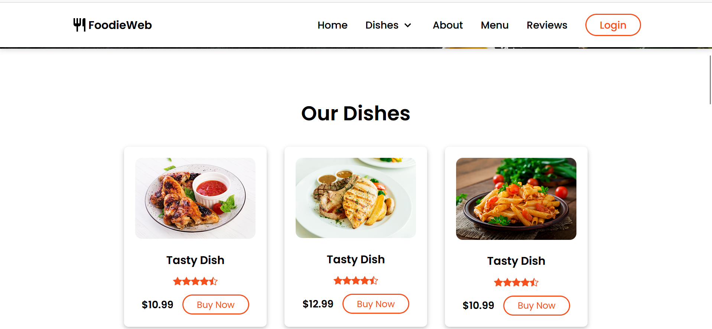
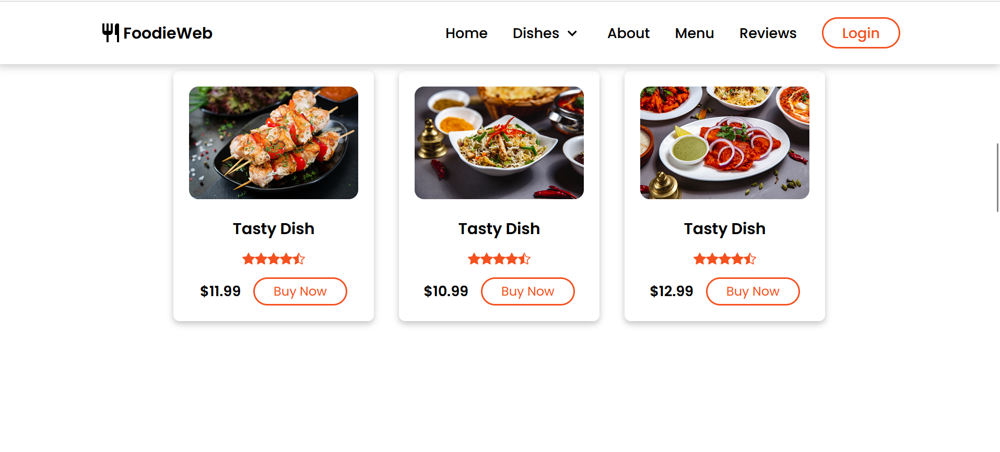
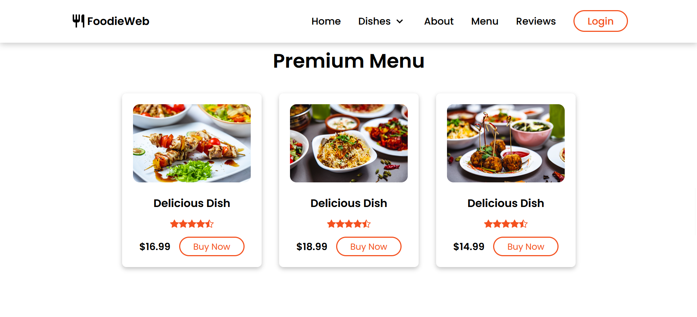
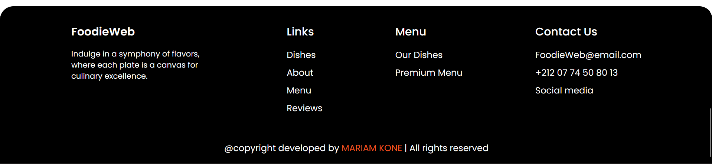

# 🚀 React + TypeScript + Vite Project

This project is a web application built using **React**, **TypeScript**, and **Vite**. It is designed to be fast, efficient, and easy to maintain.

## 🌟 Features

- Responsive and modern UI 📱
- Fast development with **Vite**
- Styled with **Tailwind CSS** 🎨
- Organized with **TypeScript**
- Hot Reloading 🔥 (instant updates without reloading the page)

## 📸 Screenshots
Here is a preview of the application:

## 🔗 Useful Links
- [React Documentation](https://react.dev/)
- [Vite Documentation](https://vitejs.dev/)
- [Tailwind CSS Documentation](https://tailwindcss.com/)
